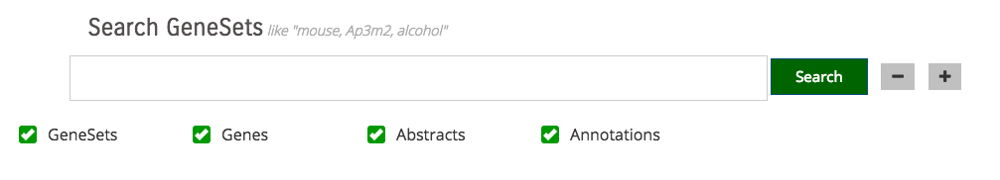
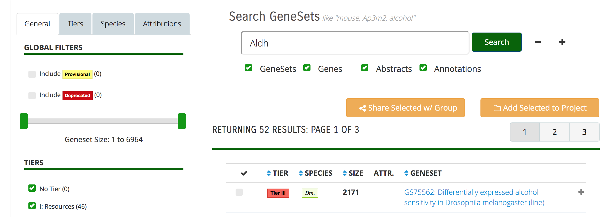
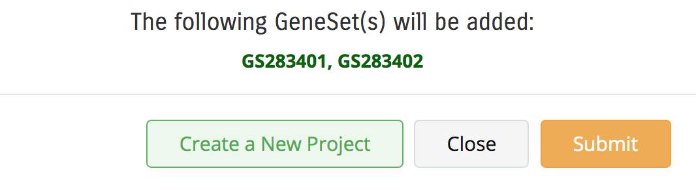
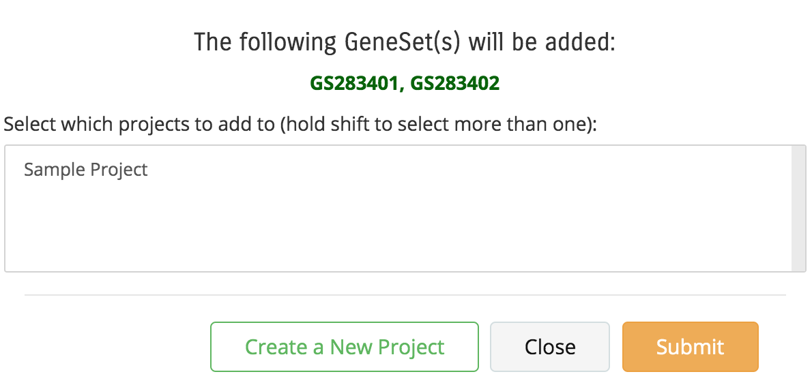
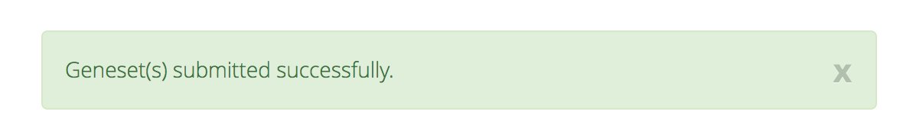
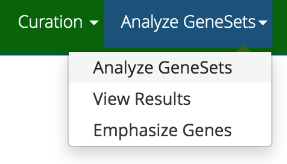

# General Search

The general GeneWeaver database search is available from the main page or by following the search icon in the header
(magnifying glass).

{ style="border: 1px solid black;" }

You can limit searches to **GeneSets**, **Genes**, **Abstracts** or **Annotations**. By default, searches will be
performed across each domain. In addition, by selecting the - or + icons next to the search bar, you can add additional 
parameters. Each parameter that is added will be evaluated as an **and** operator.

{ style="border: 1px solid black;" }

## Search Results
Search results will be limited to your appropriate permission level, so private genesets will not be shown unless you 
are the owner, or they have been explicitly shared with you via group permissions. In addition, only the top 1000 
matches will be displayed.

### Step 1: Search
Here is an example of the results when searching for the gene “Aldh”.

{ style="border: 1px solid black;" }

The resulting 52 GeneSets are displayed on 3 separate pages. Each page can be viewed by clicking on the number (1, 2, 
or 3) shown in the gray boxes.

### Step 2: Put the Results into a Project
A project is needed in order to use any of the analysis tools. Select one or more GeneSets to add to the project by 
clicking in the checkbox on the left side of each GeneSet. Now click the Add Selected to Project button.

{ style="border: 1px solid black;" }

Once the project is created, you must select it (and/or any existing ones) from the list in the dislog box and submit.

{ style="border: 1px solid black;" }

A message indicating success or an error will be displayed on the search page.

{ style="border: 1px solid black;" }

Note that selected GeneSets can also be shared with groups by using the Share selected w/Group button. Learn more about 
groups on the [Users and Groups](https://www.geneweaver.org/help/#users-and-groups) page.

### Step 3: Analyze
Go to the Analyze page in order to use GeneWeaver’s tools on your project(s) and gene sets. The link is on both the 
header and footer.

{ style="border: 1px solid black;" }

For details go to the Analysis Tools page.